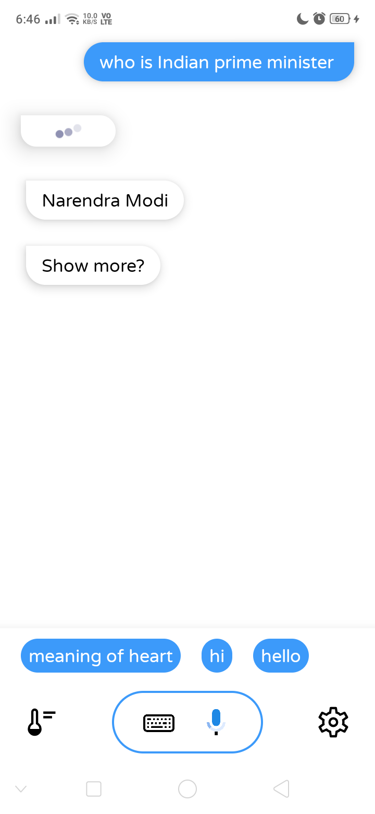
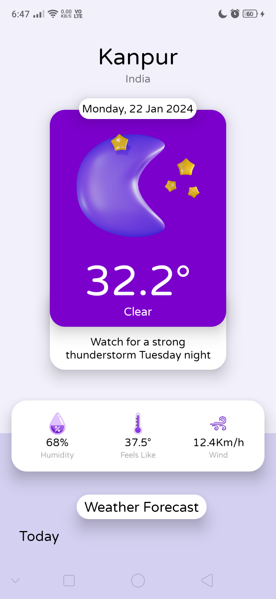
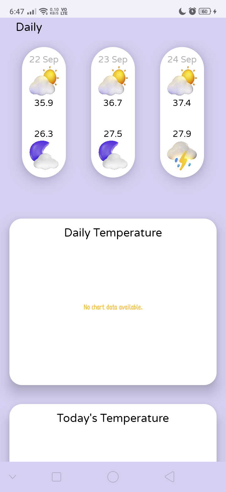
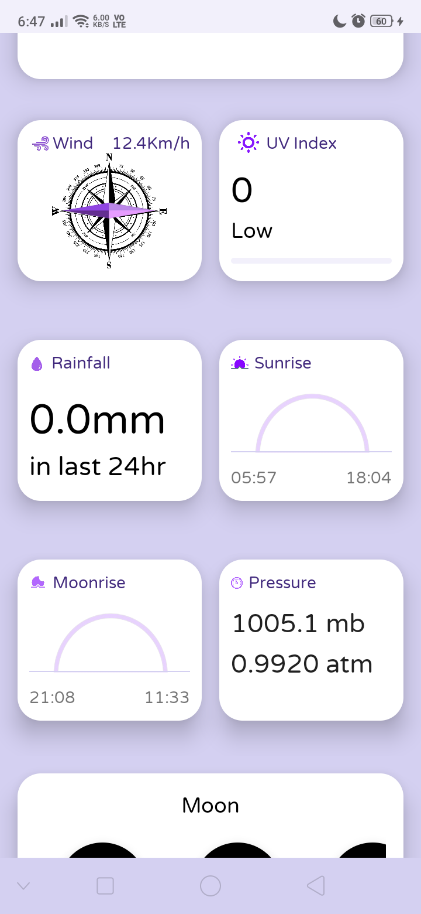
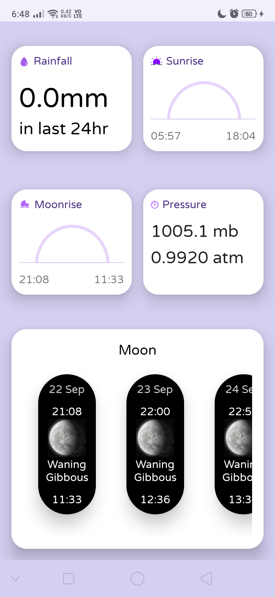

# Assistant

A **Voice Assistant** Android app that answers questions by searching the web, displaying weather, currency rates, conversions, and graphs. The app was built using Java and XML with the AIDE Android IDE.

## Features

- **Voice or Text Input**: Ask questions either by voice or typing.

- **Web Search**: Uses the Google Search API to find answers to questions.

- **Weather Information**: Displays the current weather for your city.

- **Currency Conversion**: Shows currency rates and converts between different currencies.

- **Graphs**: Visualizes data in graph form for better understanding.

- **Simple UI**: Easy to use interface for both voice and text-based input.


## How It Works

1. **Google Search API**: The app retrieves information from the web through Google's Search API, ensuring relevant and accurate answers.

2. **Weather**: Fetches live weather updates for your city.

3. **Currency Converter**: Allows you to convert between currencies with real-time exchange rates.

4. **Graphs**: Renders various graphs for visual data representation.


## Technologies Used

- **Java** for logic implementation.

- **XML** for the user interface.

- **Google Search API** for fetching answers.

- **AIDE Android IDE** for developing the app directly on Android without Android Studio.


## How to Use

1. Ask Questions: You can ask anything either by typing or using voice commands.


2. Weather: Access the weather section to get real-time updates for your city.


3. Currency: Convert different currencies in real-time.


4. Graphs: View graphs for data visualization based on your queries.


## Screenshots












## Installation

1. Clone the repository:

```bash
git clone https://github.com/yourusername/Assistant.git
```


2. Open the project in AIDE or Android Studio.


3. Compile and run it on your device.


## Future Enhancements

- Add support for more languages.

- Improve the accuracy of voice recognition.

- Add additional APIs for weather, currency, and graphs.

## License

This project is licensed under the MIT License - see the LICENSE file for details.


---

Made with ❤️ by Vishal Singh
